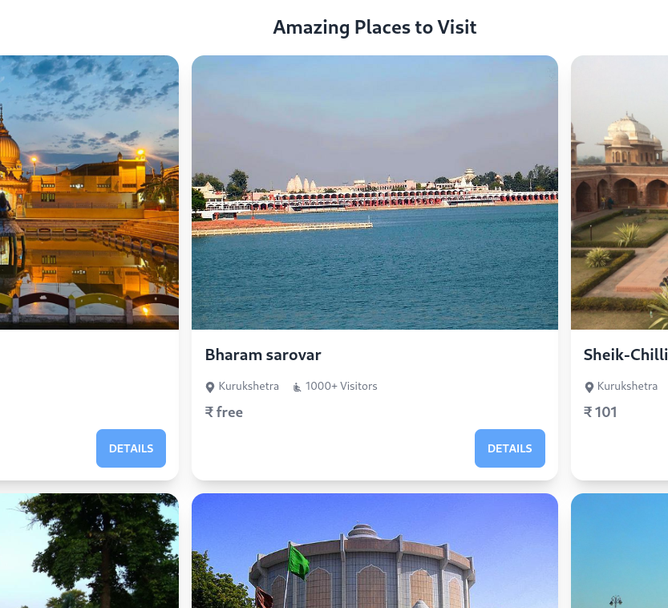

Update: This project won first prize in the hackshetra hackathon conducted by NIT Kurukshetra. 🎉

### Why KURUKSHETRA TOURISM?
One of the most common problems for tourists visiting Kurukshetra is finding places to visit. Kurukshetra is a city in the Indian state of Haryana, known for its historical and religious significance. It is the site of the epic battle of the Mahabharata, and also the birthplace of the Bhagavad Gita, one of the most revered texts in Hinduism. Due to this, there are many temples, ashrams and other religious sites that draw visitors from all over the world. However, for tourists who are not familiar with the area, it can be difficult to navigate and find all the different places of interest. This can be especially challenging for those who do not speak the local language or have limited transportation options. 

Additionally, many of the historical sites are spread out across the city and may not be well-marked, making it hard for visitors to find them without assistance. Therefore, finding a reliable source of information and guidance is crucial for tourists visiting Kurukshetra to make the most of their trip and to be able to explore all the city has to offer.

Hence In the Kurukshetra Tourism Project, we aim to develop a comprehensive platform to guide tourists in their journey to the city. 
### Features

- A list of all the places to visit in Kurukshetra with their location on the map
- Dark mode support
- Rating and reviews for each place
- Live weather conditions
- Updated Events details in Kurukshetra
- Accommodation options
- Google Authentication

The platform will be designed to be user-friendly and easy to navigate, and will provide tourists with all the information they need to make the most of their visit to Kurukshetra.

## Screenshots
<!-- screenshots/accomodation.png -->

